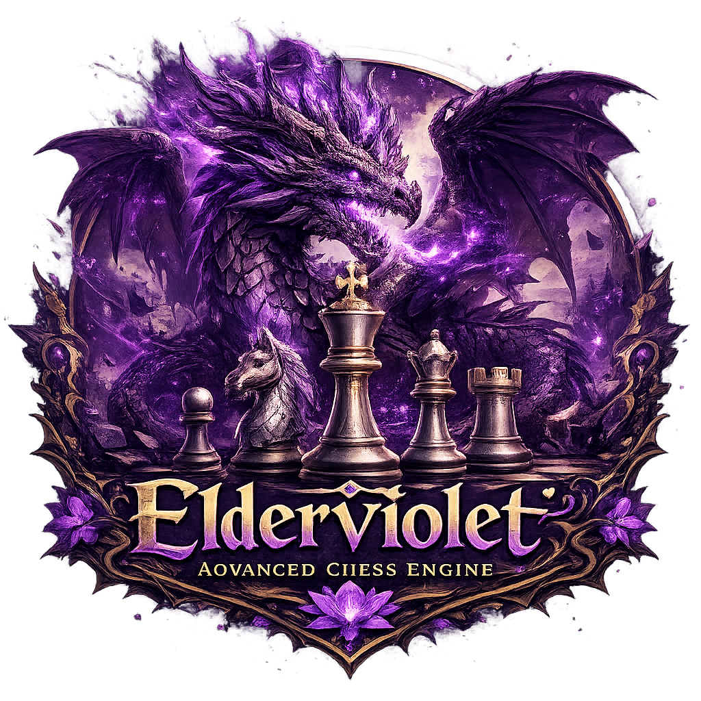

<p align="center">
  
</p>

# Elderviolet

**Elderviolet** is a quiet, strategic chess engine blending ancient wisdom, deep calculation, and relentless positional precision.

> *The Elderviolet Dragon*
> 上古紫龙
> Silent. Ancient. Unyielding.

Born from code and refined through calculation,
Elderviolet searches the board with patience and clarity.
It does not roar — it calculates.
It does not rush — it dominates.

---

<div align="center">

A modern UCI chess engine written in C++. <strong>Search deep. Evaluate precisely.</strong>

<br><br>


</div>

---

## Overview

**Elderviolet** is a UCI-compatible chess engine designed for performance, clarity, and search strength.

It focuses on classical search techniques and clean engine architecture.

Elderviolet does not include a graphical user interface (GUI).
To use the engine, connect it to a chess GUI such as:

* Arena
* CuteChess
* BanksiaGUI
* ChessBase

---

## Features

- ✔ PVS
- ✔ LMR
- ✔ Null Move Pruning
- ✔ Reverse Futility Pruning
- ✔ Futility Pruning
- ✔ Razor
- ✔ Mate Distance Pruning
- ✔ SEE + SEE full fallback
- ✔ Capture SEE prune
- ✔ Late Move Pruning
- ✔ TT + mate score 
- ✔ Killer + History
- ✔ Aspiration Window
- ✔ Lazy SMP
---

## Project Structure

The project consists of the following core components:

* `main.cpp` — Engine entry point
* `uci.h` — UCI protocol implementation
* `Search.h` — Search logic
* `Evaluation.h` — Position evaluation
* `MoveGeneration.h` — Move generation
* `Position.h` — Board representation
* `TT.h` — Transposition table
* `types.h` — Core types and definitions

---

## Usage

After compiling the engine, run it inside a UCI-compatible GUI.

Example UCI commands:

```
uci
isready
position startpos
go depth 10
```

---

## Compiling

On Windows (MSVC):

```
cl /O2 /std:c++20 main.cpp
```

On g++ / clang++:

```
g++ -O3 -std=c++20 main.cpp -o Elderviolet
```

---

## Philosophy

Elderviolet is built with simplicity and control in mind.

Every component is designed to be understandable, extendable, and efficient.

The goal is not complexity —
but strength through structure.

---

## License

This project is released under the MIT License.

